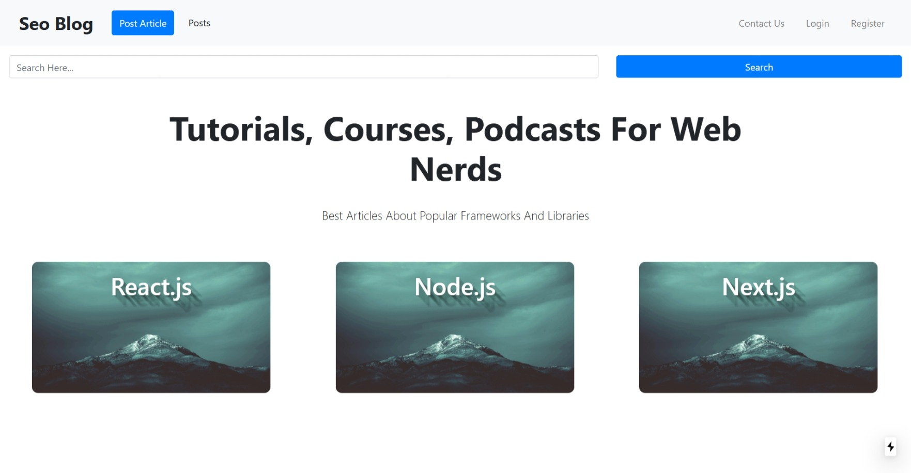
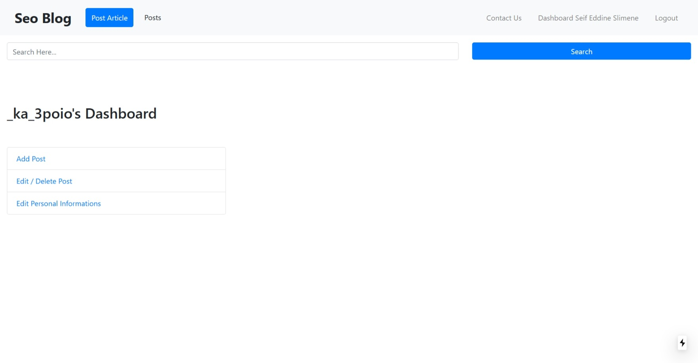
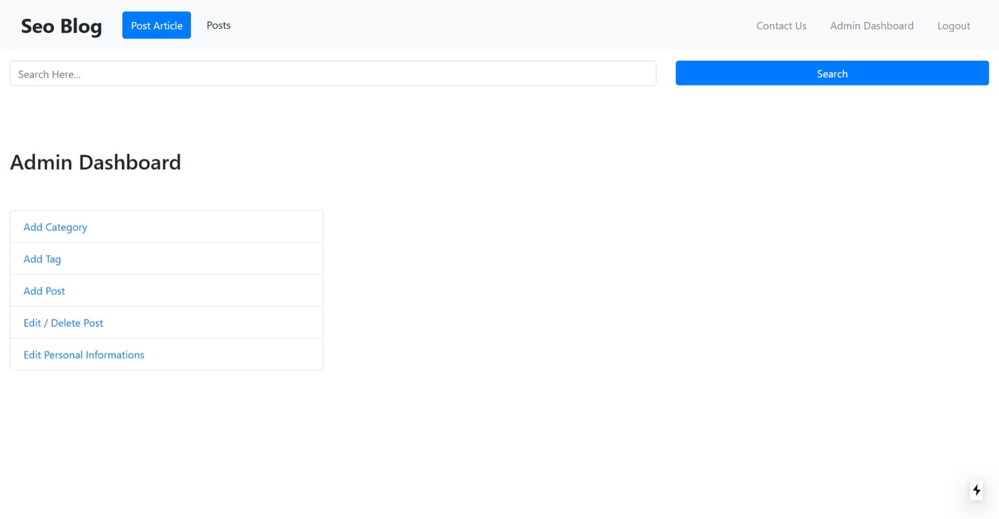
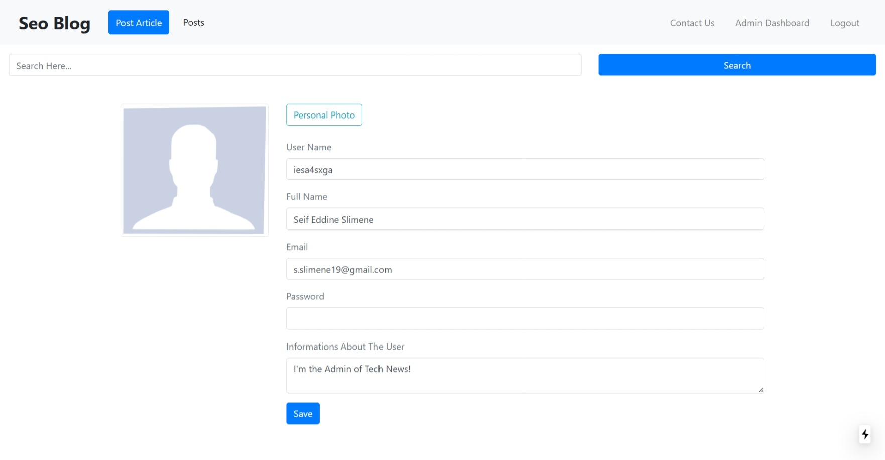

# SEO Blog Backend

Backend API built with Express and MongoDB.

## Requirements

- Node.js 16 (`.nvmrc`)
- npm
- MongoDB connection string

## Setup

```bash
nvm use
npm install
```

## Run (development)

```bash
npm run dev
```

## Run (production mode)

```bash
npm start
```

## Environment

Create/update `.env` in this folder with required keys such as:

- `DATABASE_CLOUD`
- `JWT_SECRET`
- `CLIENT_URL`
- email / OAuth credentials (if enabled)

## Admin Test Account

- Email: `seif@apprentus.com`
- Password: `123456789`
- Required role in database: `role: 1`

## Screenshots







